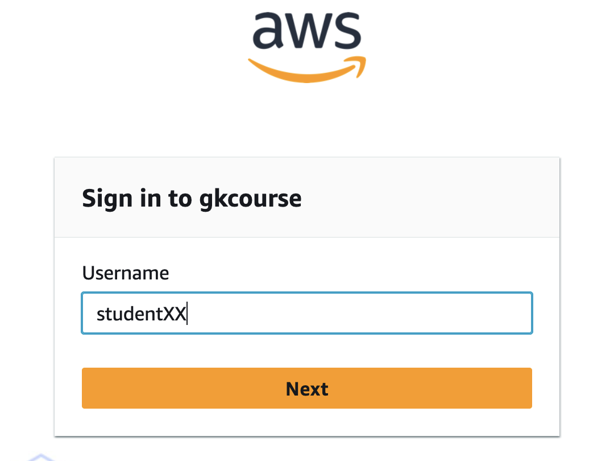
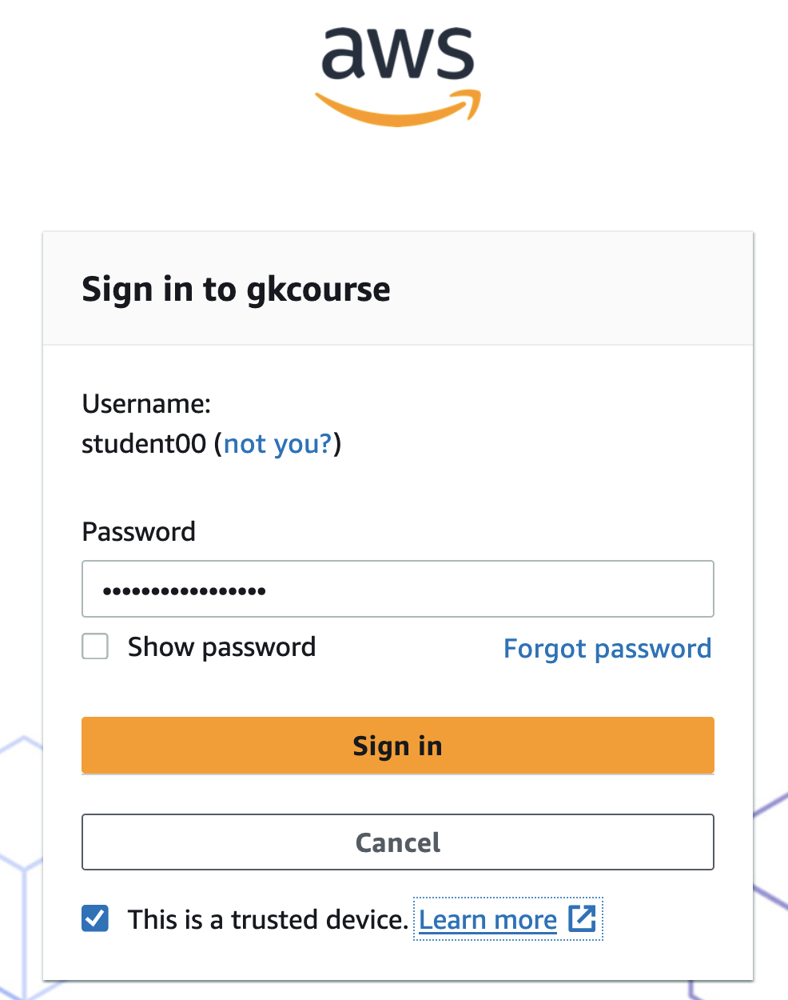
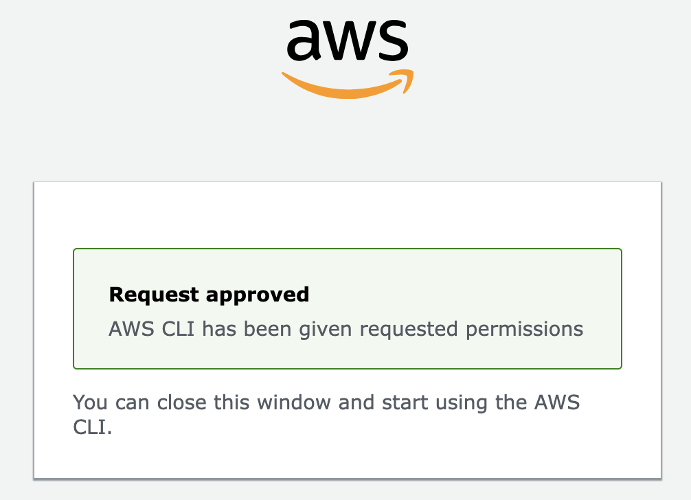
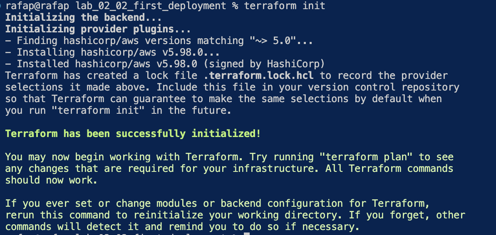
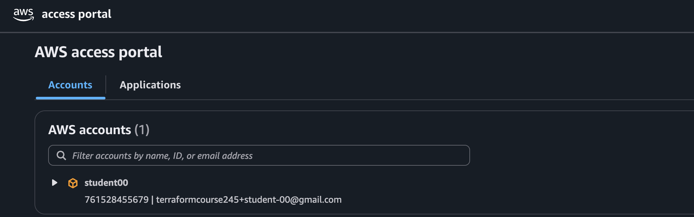
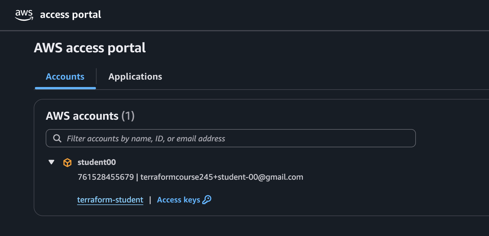

Lab 02 - 02 - First Deployment with Terraform

NOTE: This first lab is quite verbose in the instructions to help you in your initial contact with Terraform.
Future labs will be less detailed.

## 1. Lab prerequisites
- You have installed terraform (version specified by instructor) in your system.
- You have installed visual studio code or similar IDE 
- You have configured your sso profile in your machine

## 2. Lab Objectives
1. Obtain aws credentials to use in aws
2. Very quick overview of terraform code with a simple example
3. Familizarize yourself with the main terraform commands
- Verify terraform version :  `terraform -version`
- Format code:  `terraform fmt`
- Validate code:  `terraform validate`
- Plan deployment:  `terraform plan`
- Deploy infrastructure (in AWS): `terraform apply`
- Destroy infra (in AWS): `terraform destroy` 

3. First contact with Terraform configuration items (will be seen in detail later)
- Terraform Block
- Terraform Providers
- Variables
- Resources

## 1. Obtain Credentials
- Terraform needs credentials to interact with AWS
- In this course lab setup you obtain temporary credentials (this is important) using the command "aws sso login"
- You will do this every day one or more times during the labs

First off open a terminal in your VS Code and move to the directory :

`    tf_labs/2_labs/Module_02_Getting_Started/lab_02_02_first_deployment`

(for Windows users you may see the path slightly differently)

To get temporary AWS credentials associated with your profile run the following command:
```sh
aws sso login --profile sso-student
```
- This will open a web page in your default browser where you will enter your credentials:
    - Username:  `studentXX` where XX is yourstudent (e.g. 07, 11, etc.)



    - Password:  as indicated by the instructor


- Eventually you will have a login successful screen such as:



- Note that "sso-student" is the same profile configured in file `providers.tf`

### Verify Credentials:
To ensure your credentials work, issue the command:

`aws sts get-caller-identity --profile sso-student`

You should get an output similar to 
```
% aws sts get-caller-identity --profile sso-student
Account: '0123456012345'
Arn: arn:aws:sts::0123456012345:assumed-role/AWSReservedSSO_terraform-student_3e8d1ef4d90fad54/studentXX
UserId: AROA3CTVDDH7QBMUG3CH4:studentXX
```
## 2. Review terraform configuration
- Note: this is a quick overview - we will see all of this in detail in other modules
- Open the file main.tf
- Observe the different "blocks" in the configuration 
    - `terraform`  with references to the required terraform version and required providers
    - `provider aws`
    - definition of three variables 
    - creation of a aws_instance resource.  Creating resources is the main objective of terraform. 
        - this resource is an AWS EC2 Instance (a virtual machine)
        - virtual machines have a lot of parameters. In this case we specify only three. For the rest, AWS uses default values.
## 3. Test terraform commands - create our first AWS EC2 instance (Virtual Machine) with Terraform
- Verify (again) that terraform is running with `terraform -v`.  Compare the version number with the version in the `terraform` block.
- Format the code with `terraform fmt`. You may want to make some changes to the indentation of the code and run `terraform fmt` again.
- Let us validate the code with `terraform validate` - this is an initial syntactic check that verifies that the code is well written.  It could still fail when we plan or apply, but using `terraform validate` is a faster way to catch silly errors quickly
- Now we run `terraform init`
    - Terraform init is a en essential step that you run the first time you work with terraform in a given directory. It's main purpose is to download the Terraform providers (in this case AWS provider) and modules.
    - make sure you are in the same directory where the `main.tf` file is located. 
    - run `terraform init`. You will see an output similar to the one below:

    

    - some information from the `terraform init` command:
        - Terraform has downloaded to your machine the AWS provider (example version 5.98)
        - Compare that version with the one in the `provider aws` block in `main.tf`
        - A new hiddend directory called `.terraform` has also been created. The provider (or a link to the provider if using caching) is stored there.
- Terraform Plan - terraform plan is one of the most important commands. 
    - It compares the configuration (in our case `main.tf`), the "state file" (more on this later) and the resources actually deployed (in our case in AWS). Then it decides what it needs to do and lets us know.  
    - In our case terraform sees that the configuration file `main.tf` contains a resource `resource "aws_instance" "server"`. It also  queries our AWS account and sees that the corresponding AWS EC2 instance is not present. So it decides it needs to create one EC2 instance in AWS  and it informs us:
```
(...)

Terraform will perform the following actions:

  # aws_instance.server will be created
  + resource "aws_instance" "server" {
      + ami                                  = "ami-099d45c12f4cc3edc"
      + arn                                  = (known after apply)
      + associate_public_ip_address          = false

(...)

Plan: 1 to add, 0 to change, 0 to destroy.
```
    
- We will see a lot more about terraform plan in subsequent modules.
- VERY IMPORTANT:  No resources have been created in AWS - all we have is a plan.

- Creating resources : `terraform apply`
    - To actually create the resources we need to use terraform apply.
    - If we run `terraform apply` we see an output very similar to the one from `terraform plan`, but this time at the end we are asked whether we want to create the resources:

```
(...)
Plan: 1 to add, 0 to change, 0 to destroy.

Do you want to perform these actions?
  Terraform will perform the actions described above.
  Only 'yes' will be accepted to approve.

  Enter a value: 
```
- if we type 'yes', then terraform will actually create the resources.

```
  Enter a value: yes

aws_instance.server: Creating...
aws_instance.server: Still creating... [10s elapsed]
aws_instance.server: Creation complete after 13s [id=i-0896b4798f7d4d929]

Apply complete! Resources: 1 added, 0 changed, 0 destroyed.
```

## 4. Verify in the AWS Console (GUI) that the instance has been created
- Now login to your individual account using the  the AWS Console 
- Go to url : https://gkcourse.awsapps.com/start
    - Username : studentXX  (where XX is your own number assigned by the instructor)
    - Password : as assigned by your instructor
- You will then see a page similar to the one below (this is for `student00`, you will be `studentXX`):



- if you click on the little arrow after the "studentXX" you will see the profiles you can access. In this case a single one.



- Click on the `terraform-student` link and 

- Now navigate to the EC2 page in the AWS console.   Make sure you are in the `eu-south-2` region. You should see a single EC2 instance called "web". You may want to compare the values in your `main.tf` file with those of the instance:
    - What is the instance type ?
    - What is the ami-id 
    - What is the Name ? 
- Take a look at the file `terraform.tfstate` - this file contains what terraform knows it has configured in AWS.  You may want to look at the state file every time you make changes in the exercises or challenges below.
- Run the command `terraform state list` - this will show you a summary of the contents of the state file: one line per resource. 
    - TIP: For this config the output appears trivial, but this is actually a very useful command in practice for large deployments.
## 5. Making changes
- Now we make a single and simple change in our terraform configuration. 
- In the instance configuration, modify the tag.  Change "web" to "web-server". You should end up with something like:

```
resource "aws_instance" "server" {
  ami                         = var.my_ubuntu_ami
  instance_type               = var.instance_type
  associate_public_ip_address = var.use_public_ip
  tags = {
    Name = "web-server"
  }
}
```
- Now run `terraform plan` again.  What happens?
- Terraform should be proposing to make one change. `Plan: 0 to add, 1 to change, 0 to destroy.`
- This is a small change that can be done in place. Other changes, like changing the instance type, required 'replacing' the resource : destroy the instance and create it again.

- IMPORTANT: the change is not yet applied. To actually make it happen you have to run `terraform apply` again.
- This time we make it a bit different and run `terraform apply -auto-approve`. Using 'auto-approve' will perform the changes without asking us to confirm with 'yes'.  The output will include something like this at the end:
```
(...)
Plan: 0 to add, 1 to change, 0 to destroy.
aws_instance.server: Modifying... [id=i-09c79134d28e28cf5]
aws_instance.server: Modifications complete after 1s [id=i-09c79134d28e28cf5]
```
- Now go again to the aws console and note that the instance is has as Name "web-server"

- Just for fun, try `terraform plan` again, but before doing so, ask yourself what do you expect to happen.

## 6. Some challenges for you:
- Change the default value of variable `instance_type` from `t3.micro` to `t3.large`
    - run `terraform plan` - what is the output?  
    - run `terraform validate` - what is the output? (this may be a bit surprising, but the config is syntactically correct)
    - go back to `t3.micro`
- Change the default value of variable `instance_type` from `t3.micro` to `t2.micro`
    - run the following commands, but before doing so ask yourself what is the expected result 
    - (hint, in AWS to change the instance type of an EC2 instance you need to stop and start the machine)
    - this is a relatively advanced topic and will also be discussed in class
- Create a second virtual machine by copying and pasting the configuration of the resource
    - you will have 2 resources 

- Advanced - create a second virtual machine using the `count` value.
## 5. Destroying the infrastructure

